# Appointment Management System — Prototype

## Student Information
- Name: Gideon David
- Course and Section: BSCS 3A
- Subject: Software Engineering 1
- Module: Module 7 - Design and Implementation
- Instructor: Patrick Jason L. Torres

## System Description
This prototype implements the **Appointment** entity from the Appointment Management System proposed in Module 6. It allows users to add, view, edit, delete, and search appointment records through a Vue.js interface styled with Tailwind CSS.

## Selected Module 6 Entity
Appointment — with fields: Client Name, Service, Appointment Date, Appointment Time, and Status (Pending / Confirmed / Completed / Cancelled).

## Implemented Features
- Create: Add a new appointment record through a validated form
- Read: View all appointment records in a table
- Update: Edit an existing appointment record
- Delete: Remove a record after confirmation
- Complete: Mark an appointment as completed
- Search: Filter records by client name or service
- Validation: Prevents submission with empty required fields
- Persistence: Records remain after page refresh via browser localStorage

## Technologies Used
- Vue.js 3 + Vite
- Tailwind CSS v4
- JavaScript (Composition API)
- Browser localStorage
- Git + GitHub
- GitHub Actions (CI build check)

## Installation and Run Instructions
```bash
git clone https://github.com/Gideon041604/david-module7-appointment-system.git
cd surname-module7-vue-system
npm install
npm run dev
```
Open the local address shown in the terminal (e.g. http://localhost:5173/).

## About localStorage
This prototype simulates the data layer using the browser's localStorage API. Appointment records are saved as JSON under the key `module7-appointments` and are automatically loaded when the application starts, allowing data to persist across page refreshes without a real backend or database.

## Connection Between Module 6 and Module 7
Module 6 proposed a three-tier architecture (Vue.js frontend, Node.js/Express backend, MongoDB Atlas database) for the full Appointment Management System. Module 7 implements the presentation layer and application logic for one entity (Appointment) as a working frontend prototype, using localStorage in place of the backend and database, which remain proposed future components.

## Application Screenshots

### 1. Application Running in the Browser
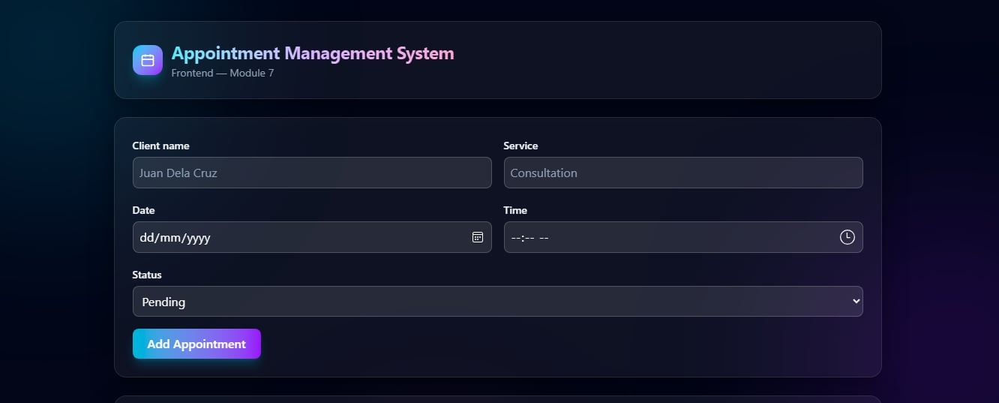

### 2. Add a New Appointment Record
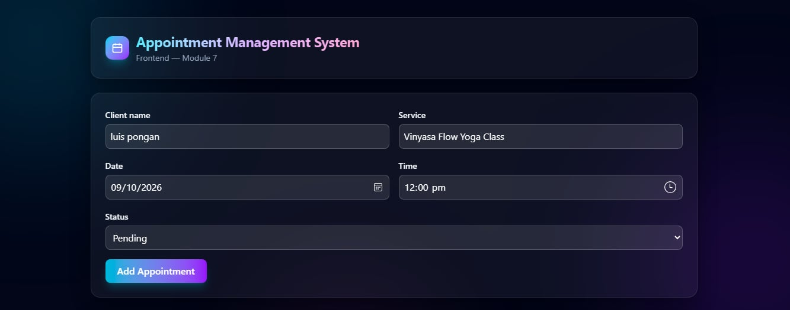

### 3. Appointment Record List
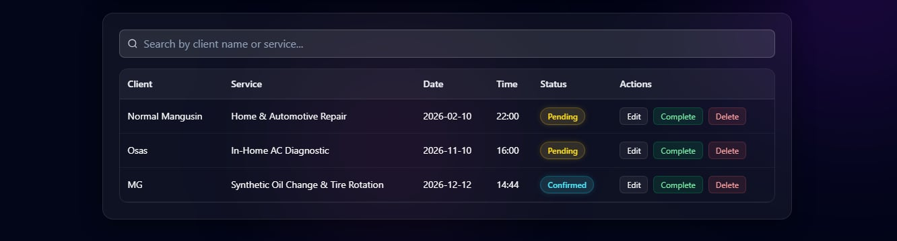

### 4. Edit an Appointment Record
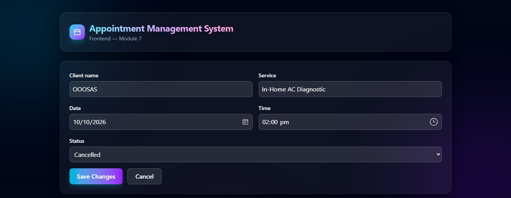

### 5. Delete Confirmation
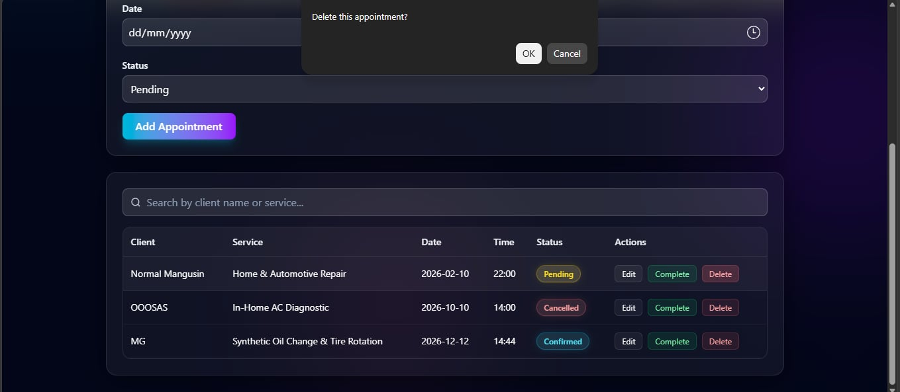

### 6. Search Function
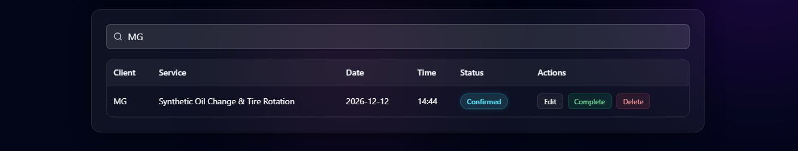

### 7. Local Storage Persistence
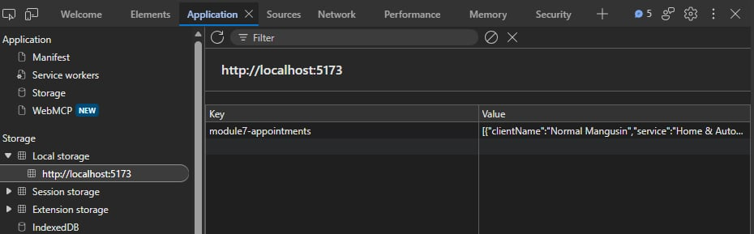

### 8. Responsive View
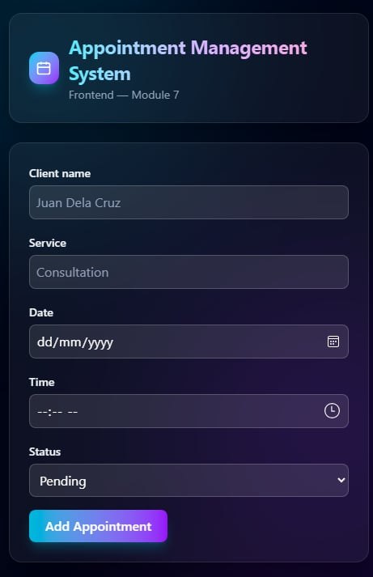

### 9. GitHub Repository
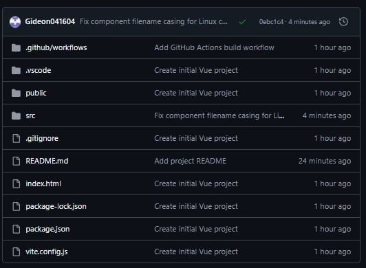

### 10. Commit History
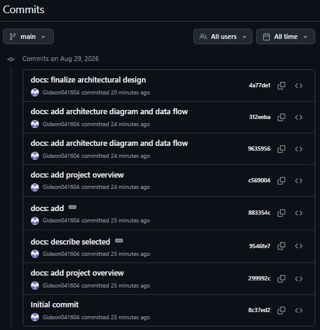

### 11. CI Build Success
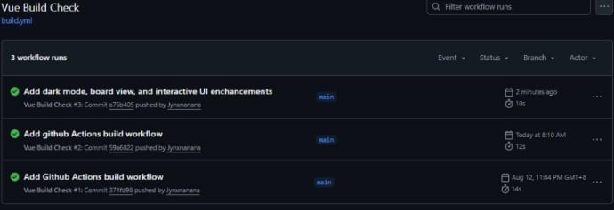

## Known Limitations and Future Improvements
- No real backend, API, or database connection — data is browser local only
- No conflict detection for overlapping appointment times yet
- Future versions will connect to the Node.js/Express backend and MongoDB Atlas database proposed in Module 6, and add staff-side scheduling and availability management features